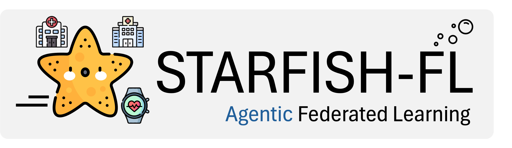

# Starfish-FL - An Agentic Federated Learning (FL) Framework



Starfish-FL is an agentic federated learning (FL) framework that is native to AI agents. It is an essential component of the STARFISH project. It focuses on federated learning and analysis for the Analysis Mandate function of STARFISH.

Starfish-FL also offers a friendly user interface for easy use in domains including healthcare, compututing resource allocation, and finance. Starfish-FL enables secure, privacy-preserving collaborative machine learning across multiple sites without centralizing sensitive data.

## Overview

Starfish-FL is a complete federatfed learning platform consisting of three main components:

- **[Controller](controller/)** - Site management and FL task execution
- **[Router](router/)** - Central coordination and message routing  
- **[Workbench](workbench/)** - Development and testing environment

### Architecture

In this section, we use healthcare as an example how Starfish-FL can be used.


### Key Concepts

**Sites**: Local environments that can act as coordinators or participants in federated learning projects.

**Controllers**: Installed on each site to manage local training, model aggregation, and provide a web interface for users.

**Coordinators**: Sites that create and manage FL projects, orchestrate training rounds, and perform model aggregation.

**Participants**: Sites that join existing projects and contribute their local data to collaborative training.

**Router**: Central routing server that maintains global state, facilitates communication between sites, and forwards messages between participants and coordinators.

**Projects**: Define one or multiple FL tasks with specified coordinator and participants.

**Tasks**: Individual machine learning operations (e.g., LogisticRegression, LinearRegression) within a project.

**Runs**: Execution instances of a project, allowing repeated training over time.

## Quick Start

### Prerequisites

- [Docker](https://docs.docker.com/engine/install/)
- [Docker Compose](https://docs.docker.com/compose/install/)

### Development Setup (All Components)

1. **Clone the repository**
   ```bash
   git clone <repository-url>
   cd starfish-fl
   ```

2. **Start all services using Workbench**
   
   The workbench provides a complete development environment with all components:
   
   ```bash
   cd workbench
   make build
   make up
   ```

3. **Initialize the database** (first time only)
   ```bash
   ./init_db.sh
   ```

4. **Create superuser for router** (first time only)
   ```bash
   docker exec -it starfish-router poetry run python3 manage.py migrate
   docker exec -it starfish-router poetry run python3 manage.py createsuperuser
   ```
   
   Make sure the username and password match what's configured in `workbench/config/controller.env`.

5. **Access the applications**
   - Router API: http://localhost:8000/starfish/api/v1/
   - Controller Web Interface: http://localhost:8001/

6. **Stop the services**
   ```bash
   make stop    # Stop services
   make down    # Stop and remove containers
   ```

## Component Documentation

### Controller

The Controller component is installed on each site participating in federated learning.

**Key Features:**
- Web-based user interface for project management
- Local model training and dataset management
- Support for multiple ML tasks (Logistic Regression, Linear Regression, SVM, ANCOVA, Ordinal Logistic Regression, Mixed Effects Logistic Regression)
- Real-time progress monitoring
- Celery-based distributed task processing

**Standalone Setup:**

See [controller/README.md](controller/README.md) for detailed installation and configuration.

**Quick Start:**
```bash
cd controller
docker-compose up -d
docker exec -it starfish-controller poetry run python3 manage.py migrate
```

Access at: http://localhost:8001/

### Router

The Router (Routing Server) maintains global state and coordinates communication between sites.

**Key Features:**
- RESTful API for site and project management
- Message forwarding between participants and coordinators
- Persistent storage for administrative data
- Support for end-to-end encryption
- Automated health checks via cron jobs

**Standalone Setup:**

See [router/README.md](router/README.md) for detailed installation and configuration.

**Quick Start:**
```bash
cd router
docker-compose up -d
docker exec -it starfish-router poetry run python3 manage.py migrate
docker exec -it starfish-router poetry run python3 manage.py createsuperuser
```

Access at: http://localhost:8000/starfish/api/v1/

### Workbench

The Workbench provides a unified development and testing environment for the entire Starfish platform.

**Key Features:**
- Docker Compose orchestration for all components
- Unified configuration management
- Development utilities and scripts
- Makefile-based build system

**Documentation:**

See [workbench/README.md](workbench/README.md) for detailed usage.

**Commands:**
```bash
cd workbench
make build       # Build all services
make up          # Start all services
make stop        # Stop services
make down        # Stop and remove containers
```

## User Guides

- **[Controller User Guide](controller/USER_GUIDE.md)** - Comprehensive guide for using the Controller web interface
- **[Task Configuration Guide](controller/TASK_GUIDE.md)** - How to configure FL tasks and models

## Development

### Technology Stack

- **Backend**: Python 3.10.10, Django
- **Task Queue**: Celery
- **Databases**: PostgreSQL (Router), SQLite (Controller)
- **Cache**: Redis
- **ML Libraries**: scikit-learn, NumPy, Pandas
- **Containerization**: Docker, Docker Compose

### Running Tests

**Router Tests:**
```bash
cd router
docker exec -it starfish-router poetry run python3 manage.py test
```

**Controller Tests:**
```bash
cd controller
docker exec -it starfish-controller poetry run python3 manage.py test
```

## Configuration

### Environment Variables

Each component uses environment files for configuration:

- **Controller**: `controller/.env` or `workbench/config/controller.env`
- **Router**: `router/.env` or `workbench/config/router.env`

**Key configuration options:**

Controller:
- `SITE_UID`: Unique identifier for the site
- `ROUTER_URL`: URL of the routing server
- `ROUTER_USERNAME`: Authentication credentials
- `ROUTER_PASSWORD`: Authentication credentials
- `CELERY_BROKER_URL`: Redis connection for Celery
- `REDIS_HOST`: Redis host for caching

Router:
- `DATABASE_HOST`: PostgreSQL host
- `POSTGRES_DB`: Database name
- `POSTGRES_USER`: Database username
- `POSTGRES_PASSWORD`: Database password
- `SECRET_KEY`: Django secret key

## Supported ML Tasks

- **Logistic Regression**: Binary classification with standard logistic regression
- **Statistical Logistic Regression**: Binary classification with statistical inference (coefficients, p-values, confidence intervals)
- **Linear Regression**: Continuous value prediction
- **SVM Regression**: Support Vector Machine regression
- **ANCOVA**: Analysis of Covariance for statistical analysis
- **Ordinal Logistic Regression**: Proportional odds model for ordered categorical outcomes
- **Mixed Effects Logistic Regression**: Multilevel logistic regression for clustered/hierarchical binary data

See [TASK_GUIDE.md](controller/TASK_GUIDE.md) for configuration details.

## Security

- End-to-end encryption support for message payloads
- Secure private key exchange between sites
- Authentication required for router access
- Site-specific UIDs for identification
- No centralized data storage - data remains at local sites

## Contributing

Contributions are welcome! Please ensure:

1. Code follows existing style and conventions
2. Tests are included for new features
3. Documentation is updated as needed
4. Docker configurations are tested

## License

Apache 2.0

## Support

For issues, questions, or contributions:

1. Check component-specific README files
2. Review user guides and task documentation
3. Open an issue in the repository

## Citation

If you use Starfish in your research, please cite:

```
@software{starfish,
  title = {Starfish-FL: A Federated Learning System},
  author = {DENOS Lab},
  year = {2026},
  url = {https://github.com/denoslab/starfish-fl}
}
```
